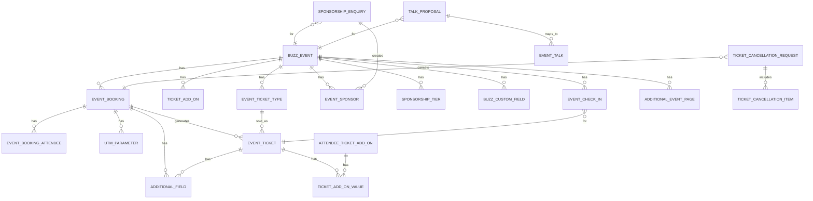

# Buzz App Architecture Notes

## Overview
- Buzz is a Frappe app for event management with a Vue 3 (FrappeUI) dashboard and Frappe Builder/public pages.
- Backend is organized into Frappe modules: `Buzz`, `Events`, `Ticketing`, `Proposals`.
- Frontend dashboard lives in `dashboard/`, built with Vite and published into `buzz/public/dashboard` and `buzz/www/dashboard.html`.

## Backend Structure
- App bootstrap and hooks: `buzz/hooks.py`
  - Requires `frappe/payments`.
  - Scheduler: `buzz.tasks.unpublish_ticket_types_after_last_date` (daily).
  - Doc events: assigns `Buzz User` role on user creation; syncs Speaker Profile display name on User update.
  - App icon entry in Desk apps screen.
- Core API: `buzz/api.py`
  - Booking, tickets, add-ons, sponsorship, check-in, languages, translations.
- Payments integration: `buzz/payments.py`
  - Creates `Event Payment` records and generates payment links via the Payments app.
- Utilities: `buzz/utils.py`
  - App-install guard decorator, custom field helpers, role assignment.
- Install/fixtures:
  - `buzz/install.py` creates default Event Categories and zoom integration fields if installed.
  - `buzz/fixtures` and `buzz/patches` for setup and migrations.

## Key DocTypes (Data Model)

### Events Module
- `Buzz Event` (`buzz/events/doctype/buzz_event`)
  - Primary entity; holds schedule, category, venue, ticketing/payment settings, sponsorship settings.
  - Creates default `Sponsorship Tier` and `Event Ticket Type` after insert.
  - Optional Zoom webinar creation/updates when `zoom_integration` is installed.
- `Event Category`, `Event Venue`, `Event Host`
  - Category slug creation; venue location geojson and map embed cleanup.
- `Event Talk`, `Talk Speaker`, `Speaker Profile`, `Event Track`
  - Talks can be generated from proposals; speaker profiles tied to User records.
- `Event Sponsor`, `Sponsorship Tier`, `Sponsorship Deck Item`
  - Sponsor uniqueness enforced per enquiry.
- `Event Check In`
  - Used for check-in records and attendance reporting.
- `Event Payment Gateway`
  - Child table for multiple payment gateways per event.
- `Additional Event Page`
  - Event-specific extra pages with route validation.

### Ticketing Module
- `Event Booking`
  - Holds attendees, pricing, tax, UTM parameters, custom fields.
  - On submit: generates `Event Ticket` documents and applies add-ons/custom fields.
- `Event Ticket`
  - Generates QR code, sends ticket email + print format attachment.
  - Creates Zoom webinar registration (if enabled).
  - Supports transfer/cancellation flows.
- `Event Ticket Type`
  - Inventory logic; tracks max tickets and remaining count.
- `Ticket Add-on` + `Ticket Add-on Value` + `Attendee Ticket Add-on`
  - Add-on definitions and per-ticket selections.
- `Bulk Ticket Coupon`
  - Auto-generates code; limits usage via claimed count.
- `Ticket Cancellation Request` + `Ticket Cancellation Item`
  - Cancel booking or specific tickets on acceptance.
- `Additional Field`
  - Generic key/value for ticket/booking custom fields.

### Proposals Module
- `Talk Proposal`
  - Maps into `Event Talk` and auto-creates users/speaker profiles if needed.
- `Sponsorship Enquiry`
  - Handles approval/payment flow; creates `Event Sponsor` on payment completion.

### Buzz Module
- `Buzz Custom Field`
  - Event-specific custom fields applied to bookings or tickets.
- `Buzz Settings`
  - Central configuration for transfer/add-on/cancellation windows.

## Backend Flows

### Booking + Payment
1. Dashboard calls `buzz.api.get_event_booking_data` to load ticket types, add-ons, custom fields, and payment gateways.
2. `buzz.api.process_booking` creates an `Event Booking` with attendees, add-ons, custom fields, and UTM parameters.
3. If total is 0, booking is auto-submitted; otherwise `Event Payment` is created and a payment URL is returned.
4. On payment authorization, `Event Booking.on_payment_authorized` marks the payment received and submits the booking.
5. Booking submission creates `Event Ticket` records and triggers QR + email flow.

### Ticket Lifecycle
- Ticket creation generates QR code file and email (with print format attachment).
- Transfers are handled via `buzz.api.transfer_ticket` with window checks from `Buzz Settings`.
- Add-on preference changes use `buzz.api.change_add_on_preference` with window checks.
- Cancellation requests are created via `buzz.api.create_cancellation_request` and are accepted/rejected in Desk.

### Sponsorships
- Web form submits `Sponsorship Enquiry`.
- Approval moves status to `Payment Pending` and triggers email notification.
- Payment link is generated via `buzz.api.create_sponsorship_payment_link`.
- Payment authorization creates `Event Sponsor` and marks enquiry as paid.

### Check-in
- Dashboard scanner validates tickets with `buzz.api.validate_ticket_for_checkin`.
- Successful check-in creates `Event Check In` and returns event/ticket context.

## API Surface (Whitelisted)
- Booking: `get_event_booking_data`, `process_booking`, `get_booking_details`, `create_cancellation_request`.
- Ticket actions: `get_ticket_details`, `transfer_ticket`, `change_add_on_preference`.
- Sponsorships: `get_sponsorship_details`, `get_user_sponsorship_inquiries`, `create_sponsorship_payment_link`, `withdraw_sponsorship_enquiry`.
- Check-in: `validate_ticket_for_checkin`, `checkin_ticket`.
- Payments: `get_event_payment_gateways` (plus payment helpers in `buzz/payments.py`).
- User + i18n: `get_user_info`, `get_enabled_languages`, `update_user_language`, `get_translations`.

## Reports
- Events:
  - `Event Overview` (tickets sold, add-ons sold, sales) in `buzz/events/report/event_overview`.
  - `Event Attendance Summary` with dynamic per-day check-ins and chart in `buzz/events/report/event_attendance_summary`.
- Ticketing:
  - `Event Add-Ons Overview` in `buzz/ticketing/report/event_add_ons_overview`.
  - `Detailed Event Registrations` with dynamic custom fields, add-ons, UTM params in `buzz/ticketing/report/detailed_event_registrations`.

## Public Pages + Web Forms
- Dashboard is served via `buzz/www/dashboard.html` (built from `dashboard/` output).
- Web forms:
  - `Apply for Sponsorship` and `Propose a Talk` under `buzz/buzz/web_form/`.
- Frappe Builder assets are under `buzz/builder_files` and `buzz/public/builder_files` (currently empty stubs/asset containers).

## Frontend (Vue Dashboard)

### Entry + Build
- Entry: `dashboard/src/main.js` mounts `App.vue` with router, resources, translation plugin, and socket.
- Build: `dashboard/vite.config.js` outputs to `buzz/public/dashboard` and updates `buzz/www/dashboard.html`.
- Base URL: `/dashboard` (router history uses `createWebHistory("/dashboard")`).

### Routing
- Public-like flows: booking (`/book-tickets/:eventRoute`) and check-in (`/check-in`).
- Account area under `/account`:
  - bookings list/details, tickets list/details, sponsorships list/details.
- Guard: `router.beforeEach` checks `buzz.api.get_user_info` and redirects to `/login` if unauthenticated.

### Data Access Pattern
- Uses `frappe-ui` `createResource` and `createListResource` for API calls.
- API endpoints map directly to backend whitelisted methods (see API Surface above).
- Session state in `dashboard/src/data/session.js` handles login/logout and cookie-based session user.

### Key UI Components
- Booking flow: `BookingForm.vue`, `PaymentGatewayDialog.vue`, `BookingSummary.vue`.
- Ticket management: `TicketDetails.vue`, `TicketTransferDialog.vue`, `AddOnPreferenceDialog.vue`, `CancellationRequestDialog.vue`.
- Sponsorship management: `SponsorshipDetails.vue`, `SponsorshipPaymentDialog.vue`, `SponsorLogoUploader.vue`.
- Check-in: `CheckInScanner.vue`, `EventSelector.vue`, `QRScanner.vue`.
- Shared: `Navbar.vue`, `LanguageSwitcher.vue`, `SuccessMessage.vue`.

### Notable Composables + Utils
- `useTicketValidation` handles check-in validation flow and audio feedback.
- `usePaymentSuccess` handles success banners + confetti and URL cleanup.
- `useBookingFormStorage` keeps draft booking data in localStorage per event.
- `useLanguage` changes user language and reloads translations.

## Integrations
- Payments app required (gateway link generation + payment receipt recording).
- Zoom integration optional; `Buzz Event` can create/update webinars and register attendees.

## Permissions + Roles
- Roles: `Buzz User`, `Frontdesk Manager` (fixtures in hooks).
- Check-in APIs restricted to `Frontdesk Manager`.
- Sponsorship details restricted to enquiry owner or users with permission.

## Key Paths for Feature Work
- Booking logic: `buzz/api.py`, `buzz/ticketing/doctype/event_booking`, `dashboard/src/components/BookingForm.vue`.
- Ticket lifecycle: `buzz/ticketing/doctype/event_ticket`, `dashboard/src/pages/TicketDetails.vue`.
- Sponsorship lifecycle: `buzz/proposals/doctype/sponsorship_enquiry`, `dashboard/src/pages/SponsorshipDetails.vue`.
- Check-in flow: `buzz/api.py`, `dashboard/src/pages/CheckInScanner.vue`.
- Event configuration: `buzz/events/doctype/buzz_event` and related event doctypes.

## Notes / Gotchas
- Payment gateway selection is event-scoped via `Event Payment Gateway` child rows.
- Event routes are auto-generated when publishing (`Buzz Event`, `Additional Event Page`).
- Custom fields are event-scoped (`Buzz Custom Field`) and can apply to booking or ticket.
- Ticket type availability is enforced at booking time, plus daily auto-unpublish by scheduler.

## Data Model Diagram (DocTypes + Relationships)

## Frontend Page -> API Map
- `dashboard/src/pages/BookTickets.vue`
  - `buzz.api.get_event_booking_data` to load event booking config.
  - `buzz.api.process_booking` via `dashboard/src/components/BookingForm.vue`.
- `dashboard/src/pages/BookingDetails.vue`
  - `buzz.api.get_booking_details` for booking + ticket data.
  - `buzz.api.create_cancellation_request` via `dashboard/src/components/CancellationRequestDialog.vue`.
  - `buzz.api.transfer_ticket` via `dashboard/src/components/TicketsSection.vue`.
- `dashboard/src/pages/TicketDetails.vue`
  - `buzz.api.get_ticket_details`.
  - `buzz.api.change_add_on_preference` via `dashboard/src/components/AddOnPreferenceDialog.vue`.
  - `buzz.api.transfer_ticket` via `dashboard/src/components/TicketTransferDialog.vue`.
- `dashboard/src/pages/SponsorshipsList.vue`
  - `buzz.api.get_user_sponsorship_inquiries`.
- `dashboard/src/pages/SponsorshipDetails.vue`
  - `buzz.api.get_sponsorship_details`.
  - `buzz.api.withdraw_sponsorship_enquiry`.
  - `buzz.api.get_event_payment_gateways` and `buzz.api.create_sponsorship_payment_link` via `dashboard/src/components/SponsorshipPaymentDialog.vue`.
- `dashboard/src/pages/CheckInScanner.vue`
  - `buzz.api.validate_ticket_for_checkin` and `buzz.api.checkin_ticket` via `dashboard/src/composables/useTicketValidation.js`.
- `dashboard/src/data/user.js`
  - `buzz.api.get_user_info` for session user details and roles.
- `dashboard/src/composables/useLanguage.js`
  - `buzz.api.get_enabled_languages`, `buzz.api.update_user_language`.
- `dashboard/src/translation.js`
  - `buzz.api.get_translations`.

## Feature Development Checklist (Common Changes)
- Tickets / booking changes
  - Update `buzz/api.py` for API shape changes and `Event Booking`/`Event Ticket` doctypes for business logic.
  - Keep `BookingForm.vue` payload mapping in sync with backend expectations.
  - Update reports if new fields should be exported (`Detailed Event Registrations`).
- Add-on or custom field changes
  - Check `Buzz Custom Field` logic and `Additional Field` usage in booking/tickets.
  - Update frontend rendering in `CustomFieldInput.vue` and `BookingForm.vue`.
- Payment flow changes
  - Update `buzz/payments.py` and any event-scoped gateway selection logic.
  - Ensure payment redirects still land on `/dashboard/...?...success=true`.
- Sponsorship flow changes
  - Update `Sponsorship Enquiry` for status transitions and `SponsorshipDetails.vue` for UI state.
  - Verify sponsor creation in `on_payment_authorized`.
- Check-in changes
  - Update `buzz.api.validate_ticket_for_checkin` and `CheckInScanner.vue`/`useTicketValidation.js`.
  - Confirm role gating for `Frontdesk Manager` remains consistent.
- Event publishing or public pages
  - Review `Buzz Event` route generation and `Additional Event Page` route uniqueness.
  - If using Builder, update assets under `buzz/builder_files` and publish to `buzz/public/builder_files`.
